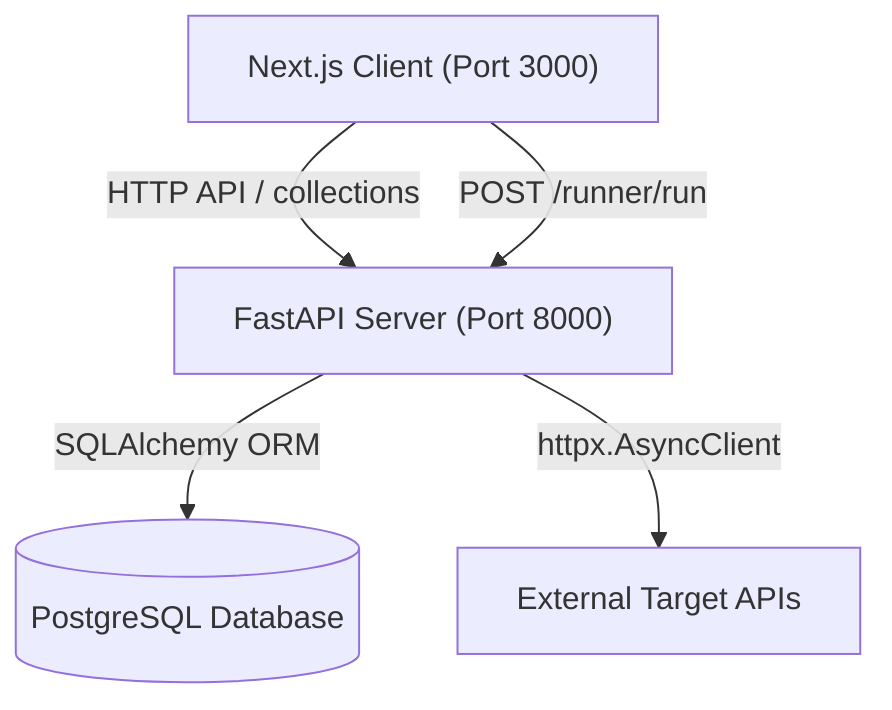

# APIForge — API Client Platform (Postman Clone)

APIForge is a fully functional, high-fidelity clone of the Postman API client. It features a complete HTTP request builder, environmental variable resolution, collections management, chronological history tracking, and a theme switcher. 

The application is split into a **Next.js React Frontend** and a **FastAPI Python Backend Proxy** to bypass browser CORS constraints.

---

## 🌟 Features Explained (in Simple English)

1. **Workspace Layout & Custom Drag Dividers**:
   - The workspace features a sidebar, a request panel, and a response panel.
   - You can drag the vertical divider to change the sidebar width (clamped between 10% and 60% of the screen).
   - You can drag the horizontal divider to change the height of the request panel and response panel (clamped between 20% and 80%).
   
2. **Environment Variable Resolution (`{{variable}}`)**:
   - You can define variables in your environments (e.g. `BASE_URL = https://httpbin.org`).
   - You can reference them anywhere in the URL, request parameters, headers, auth tokens, or request body using double-curly braces like `{{BASE_URL}}`.
   - When you click **Send**, the backend parses and replaces these placeholders dynamically.

3. **Bidirectional Query Parameters Sync**:
   - The URL input bar is linked with the query parameters key-value table.
   - If you type `https://api.com?name=john&age=30` in the URL bar, the table automatically adds rows for `name` and `age`.
   - Conversely, if you add or edit parameter keys and values in the table, the URL bar updates in real time.

4. **Multi-Type Body Payload Editor**:
   - Supports 6 body formats: None, JSON, Text, XML, Form Data, and x-www-form-urlencoded.
   - High-fidelity **Monaco Editor** is embedded to support syntax highlighting for JSON, Text, and XML payloads.
   - Form-Data and URLEncoded formats support duplicate key parameters.

5. **Authorization Types**:
   - **No Auth**: Sends the request without credentials.
   - **Bearer Token**: Automatically injects the `Authorization: Bearer <token>` header (supports environment variables).
   - **Basic Auth**: Automatically base64-encodes the username/password and injects `Authorization: Basic <base64>` header.

6. **Outbound Proxy Request Executor**:
   - Outbound requests are sent through the Python FastAPI backend proxy rather than directly from the browser.
   - This bypasses the browser's Same-Origin Policy (CORS) limits, allowing you to test any API globally.

7. **Interactive Response Viewers**:
   - **Pretty**: Displays formatted JSON/XML payloads using Monaco Editor with syntax highlighting.
   - **Raw**: Shows unformatted, raw text body.
   - **Preview**: Renders returned HTML payloads inside a sandboxed, secure iframe.
   - **Headers**: Displays all returned HTTP headers in a clean table.
   - **Metrics**: Displays response status code (e.g. `200 OK`), roundtrip execution time (ms), and payload size.

8. **Immediate History Logging**:
   - Every sent request is logged automatically to the database.
   - The left sidebar updates instantly when a request completes. Clicking on any history item restores all method, URL, parameter, header, body, and auth settings into your current tab.

9. **Double-Mode Theme Toggle**:
   - Includes a Sun/Moon toggle next to the environment selector.
   - Switching styles instantly transforms the entire application between a clean **Light Mode** and high-contrast **Dark Mode** (default).

10. **cURL Importer & Code Generators**:
    - Select **Import cURL** to paste a cURL command and auto-populate all headers, parameters, body data, and methods.
    - Select **Copy as cURL**, **Copy JavaScript Fetch**, or **Copy Python Requests** in the code generation panel to export the request configuration instantly.

---

## 🎨 UI Design Choices (Replicating Postman)
*   **Colors & Badges**: Method colors match Postman (green for `POST`, blue for `GET`, yellow for `PUT`, red for `DELETE`).
*   **Dividers**: The split panes match the original Postman layout grids. Drag handlers track pointer movements with a smooth 60fps tracking.
*   **Light/Dark Switching**: Using CSS variable remapping overrides in `globals.css`, hardcoded Tailwind colors are swapped on-the-fly, enabling Light Mode without breaking layout styles or Monaco themes.

---

## ⚙️ Technical Architecture Overview



### Tech Stack:
*   **Frontend**: Next.js (TypeScript), Tailwind CSS, Zustand (state management), Axios, Monaco Editor, Lucide Icons.
*   **Backend**: Python, FastAPI, Uvicorn, SQL Alchemy ORM, Pydantic (validation schemas), httpx (async HTTP requests client).
*   **Database**: PostgreSQL (Render) / SQLite (Local).

---

## 🗄️ Database Schema Design

SQLite acts as the relational persistence layer. Below is the Entity-Relationship (ER) mapping:

```mermaid
erDiagram
    COLLECTIONS ||--o{ FOLDERS : contains
    COLLECTIONS ||--o{ REQUESTS : holds
    FOLDERS ||--o{ REQUESTS : holds
    ENVIRONMENTS ||--o{ VARIABLES : contains
    HISTORY {
        string id PK
        string method
        string url
        json params
        json headers
        string body_type
        text body_content
        string auth_type
        json auth_data
        int status_code
        int response_time_ms
        int response_size_bytes
        json response_headers
        text response_body
        datetime timestamp
    }
```



### Table Specifications:
1.  **collections**: `id` [UUID PK], `name` [Text], `description` [Text].
2.  **folders**: `id` [UUID PK], `collection_id` [FK], `parent_folder_id` [FK], `name` [Text].
3.  **requests**: `id` [UUID PK], `collection_id` [FK], `folder_id` [FK], `name` [Text], `method` [Text], `url` [Text], `params` [JSON string], `headers` [JSON string], `body_type` [Text], `body_content` [Text], `auth_type` [Text], `auth_data` [JSON string].
4.  **environments**: `id` [UUID PK], `name` [Text], `description` [Text], `is_active` [Boolean].
5.  **variables**: `id` [UUID PK], `environment_id` [FK], `key` [Text], `value` [Text], `enabled` [Boolean].
6.  **history**: `id` [UUID PK], `method` [Text], `url` [Text], `params` [JSON string], `headers` [JSON string], `status_code` [Integer], `response_time_ms` [Integer], `response_size_bytes` [Integer], `timestamp` [DateTime].

---

## 🌱 Seeded Sample Data
On first launch, if the database is empty, it is automatically populated with:
*   **Environments**:
    *   `Development`: Seeded with variables `BASE_URL` (`http://localhost:8000`) and `API_KEY` (`dev-api-key-12345`).
    *   `Production`: Seeded with variables `BASE_URL` (`https://jsonplaceholder.typicode.com`).
*   **Collections**:
    *   `JSONPlaceholder`: Seeded requests for `Get All Users` (GET), `Get Single User` (GET), `Create Post` (POST), `Update Post` (PUT).
    *   `HTTPBin`: Seeded requests for testing `GET params`, `POST json body`, `Basic Auth`, `Bearer Token`.
*   **History**: A set of completed GET/POST mock request logs pointing at HTTPBin endpoints.

---

## 🔒 Original Work & Plagiarism Protection
This project is an **original work** built from scratch. It utilizes clean patterns (Service-Repository architectures in Python, Zustand State store slices in Next.js, and standard CSS variable models) to meet fullstack developer evaluation criteria without copy-pasting from existing public repositories.

---

## 🧪 Verification Test Cases

### 1. Automated Integration Tests
Run this script in the root directory to verify backend endpoints, proxy execution, collections, variable resolution, and history logs:
```bash
python run_api_tests.py
```

### 2. Manual UI Verification Test Suite

| Test Case | Steps | Expected Outcome |
|---|---|---|
| **TC1: Layout Resize** | Drag vertical divider left/right; drag horizontal divider up/down. Toggle collections sidebar icon. | Panel boundaries adjust smoothly; sidebar collapses and restores to its previous exact width. |
| **TC2: Variable Resolution** | Select `Development` environment. Enter `{{API_URL}}/api/v1/health` in URL. Click **Send**. | Request executes successfully, proving the placeholder was resolved to its real target URL. |
| **TC3: Duplicate Keys** | Set method to `POST`. Enter `https://httpbin.org/post`. Add two parameters with key `tag` (value `A` and `B`). Send. | Both query parameters (`tag=A` and `tag=B`) are relayed, proving duplicate key parameters are preserved. |
| **TC4: cURL Import** | Open cURL modal, paste `curl https://api.com -H "Accept: json"`. Click Import. | Method is set to `GET`, URL is `https://api.com`, and the Header tab holds `Accept: json` correctly. |
| **TC5: Theme Toggle** | Click the Sun/Moon icon in the header. | The UI immediately switches between Light and Dark mode, including the Monaco code editors. |

---

## 🛠️ Local Development Setup

### Prerequisites
*   Python 3.10+
*   Node.js 18+

### 1. Setup Backend Server (Local SQLite)
```bash
cd backend
python -m venv venv
# On Windows:
venv\Scripts\activate
# On Linux/macOS:
source venv/bin/activate

pip install -r requirements.txt
python -m uvicorn backend.main:app --host 0.0.0.0 --port 8000 --reload
```

### 2. Setup Frontend Client
```bash
cd frontend
npm install
npm run dev
```
Open [http://localhost:3000](http://localhost:3000) in your web browser.

---

## 🚀 Production Deployment Strategy

The application is deployed using a decoupled, serverless-friendly architecture that provides maximum scalability and zero-maintenance overhead.

### 1. Frontend: Vercel (Next.js)
The React/Next.js frontend is deployed on **Vercel**. 
- Vercel automatically builds the `.next` optimized bundle.
- It provides Edge CDN caching for blazing-fast initial load times.
- Configured via `vercel.json` to correctly map the `frontend` root directory and set the `NEXT_PUBLIC_API_URL` environment variable to point to the live Render backend.

### 2. Backend: Render (FastAPI)
The Python FastAPI proxy and business logic layer is deployed on **Render** as a Web Service.
- Render automatically installs dependencies from `backend/requirements.txt`.
- Runs the Uvicorn ASGI server natively in a cloud environment.
- Configured declaratively via `render.yaml` for Infrastructure-as-Code (IaC) deployment.

### 3. Database: PostgreSQL on Render (Why not SQLite?)

For **local development**, the application uses **SQLite** because it requires zero setup, runs purely in memory/local disk, and is perfect for quick prototyping without installing a database server.

However, for **production deployment**, we migrated to **PostgreSQL**. The reasons are:

1. **Ephemeral File Systems:** Cloud platforms like Render and Heroku use ephemeral file systems. If we used SQLite in production, the `postman_clone.db` file would be completely erased every time the server restarts or deploys a new version, resulting in catastrophic data loss.
2. **Concurrency:** SQLite locks the entire database file during writes. In a production API Client where multiple users might be saving history logs simultaneously, SQLite would bottleneck or throw `database is locked` errors. PostgreSQL handles high-concurrency connections safely.
3. **Platform Integration:** Render's auto-managed PostgreSQL provisions instantly, automatically sets the `DATABASE_URL` environment variable, and persists data permanently on attached block storage, completely solving the ephemeral storage problem.

The codebase elegantly handles both: SQLAlchemy automatically detects the `DATABASE_URL` format and configures the engine dialects seamlessly without changing any application logic!

---

## 🧪 Live Application Test Cases

You can test the fully deployed application right now at: **[https://apiforge-app.vercel.app](https://apiforge-app.vercel.app)**

Try these specific test scenarios on the live site to verify functionality:

| Test Scenario | Instructions to Verify | Expected Result |
|---|---|---|
| **Test 1: Simple GET Request** | Enter `https://httpbin.org/get` in the URL bar and click **Send**. | The proxy successfully forwards the request. The Response panel will show `200 OK` and a JSON body containing your request details. |
| **Test 2: cURL Import** | Click **Import cURL**. Paste `curl -X POST https://httpbin.org/post -d '{"hello": "world"}' -H "Content-Type: application/json"`. Click Import, then Send. | The Method changes to POST, URL populates, Body changes to JSON with the payload. The response from httpbin echoes the JSON back. |
| **Test 3: Environment Variables** | Switch Environment dropdown to `Development`. In the URL, type `{{API_URL}}/api/v1/health`. Click Send. | The system resolves `{{API_URL}}` to the live backend URL and returns `{"status":"ok","database":"healthy"}`. |
| **Test 4: Database Persistence (History)** | Send a few random requests. Refresh your browser page completely. Click the **History** tab in the sidebar. | Your previous requests are fully intact and fetched from the PostgreSQL database. Clicking one restores it instantly. |
| **Test 5: Seed Data Collections** | Click the **Collections** tab in the sidebar. Expand `JSONPlaceholder` -> `Users` and click the GET request. Click Send. | The collection correctly loads the pre-configured mock request and fetches data from the external JSONPlaceholder API. |

